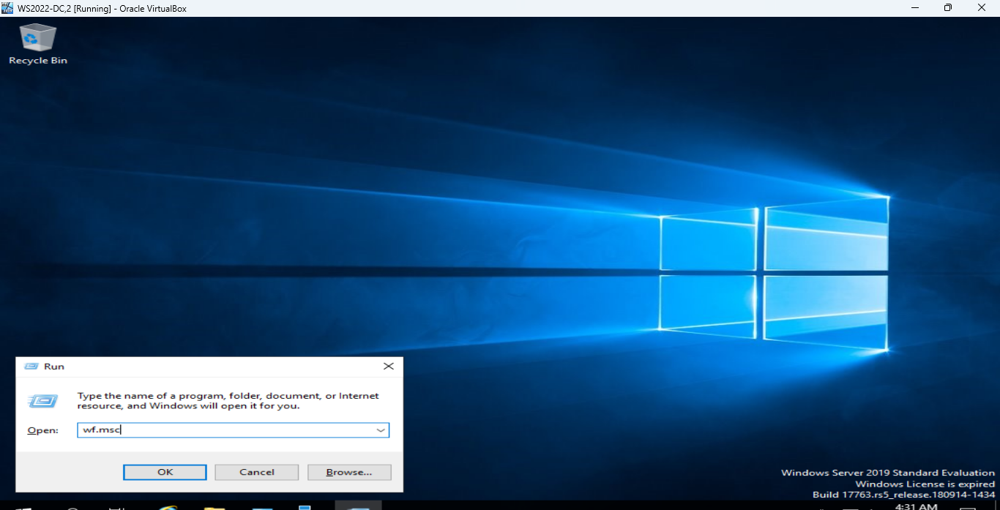
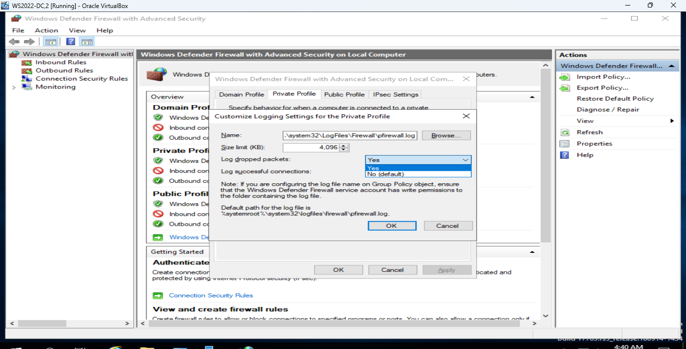
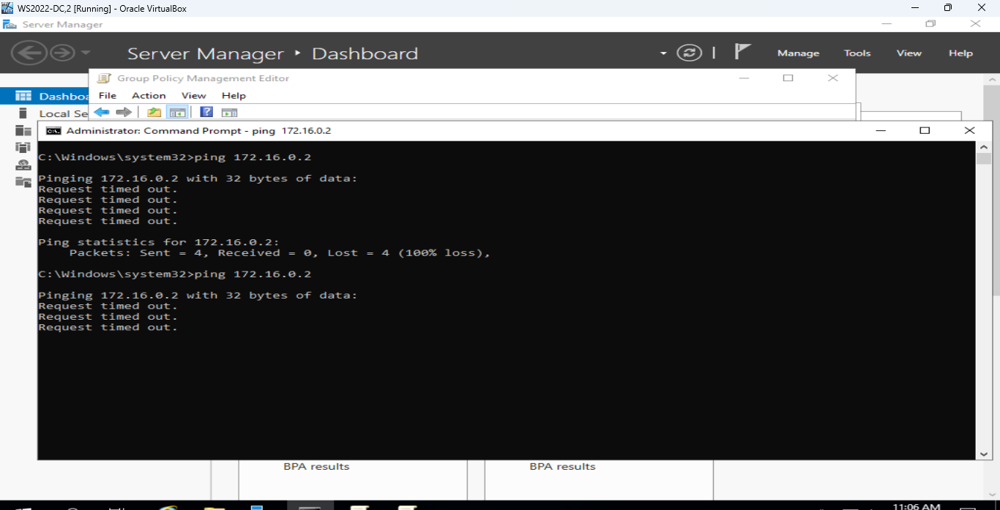
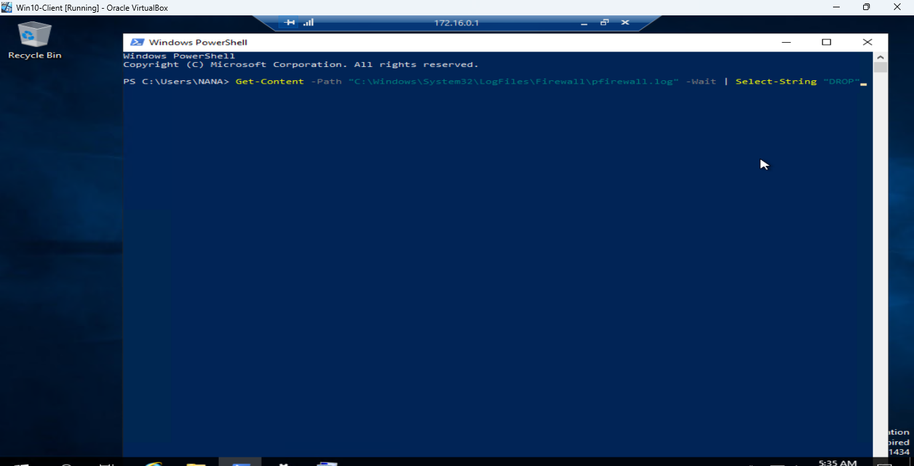

# Host-Based Firewall Hardening & Network Telemetry Analysis
By [Your Name]

## 📌 Project Overview
This practical lab demonstrates how to configure, deploy, and analyze host-based firewall defensive rules within a Windows corporate environment. Using a Windows Server instance alongside a Windows 10 client, I simulated a common adversarial threat: **internal lateral movement via unauthorized Remote Desktop Protocol (RDP) probes**. 

By applying a "Least Privilege" network architecture, I implemented an explicit inbound block rule, enabled advanced security auditing, and parsed the raw host-level firewall logs using PowerShell to identify and isolate the simulated attack telemetry.

## 🛠️ Technologies & Environments Used
* **Hypervisor:** Oracle VirtualBox
* **Operating Systems:** Windows Server (Target Server), Windows 10 (Compromised Client Node)
* **Firewall Engine:** Windows Defender Firewall with Advanced Security (WDFAS)
* **Log Analysis Automation:** Windows PowerShell

---

## 🏗️ Lab Architecture & Execution Steps

### Step 1: Establishing the Baseline (The Control Phase)
To verify network connectivity prior to hardening, I initiated an RDP connection from the Windows 10 Client node to the Windows Server. The connection was successful, establishing our baseline exposure.


*Figure 1: Baseline verification showing open RDP access from the client workstation.*

### Step 2: Activating Advanced Security Telemetry
By default, Windows Firewall silently discards dropped packets without indexing them into standard security logs. As a SOC analyst, visibility is paramount. I modified the Active/Private Firewall Profile to explicitly capture dropped packets, directing the audit stream to `%systemroot%\system32\LogFiles\Firewall\pfirewall.log`.

### Step 3: Engineering the Inbound Defense Rule
To mitigate unauthorized internal traversal, I built a custom Inbound Security Rule targeting **TCP Port 3389 (RDP)**. The rule applies a hard denial to the explicit remote IP address of the Windows 10 Client while maintaining normal network operations for trusted assets.


*Figure 2: Custom rule setup targeting RDP port 3389 restricted to the client's explicit IP.*

### Step 4: Incident Simulation (The Attack Phase)
With defenses live, I re-executed the RDP connection request from the compromised Windows 10 client. The connection was successfully intercepted and dropped by the firewall architecture, resulting in a connection timeout error on the host terminal.


*Figure 3: Connection failure screen on the client machine confirming defensive rule execution.*

---

## 🔍 Log Analysis & Threat Hunting
Using PowerShell with administrative privileges, I monitored the live security log stream to extract the drop telemetry. This process mirrors how an enterprise SIEM parses security logs at scale.

```powershell
Get-Content -Path "C:\Windows\System32\LogFiles\Firewall\pfirewall.log" -Wait | Select-String "DROP"



